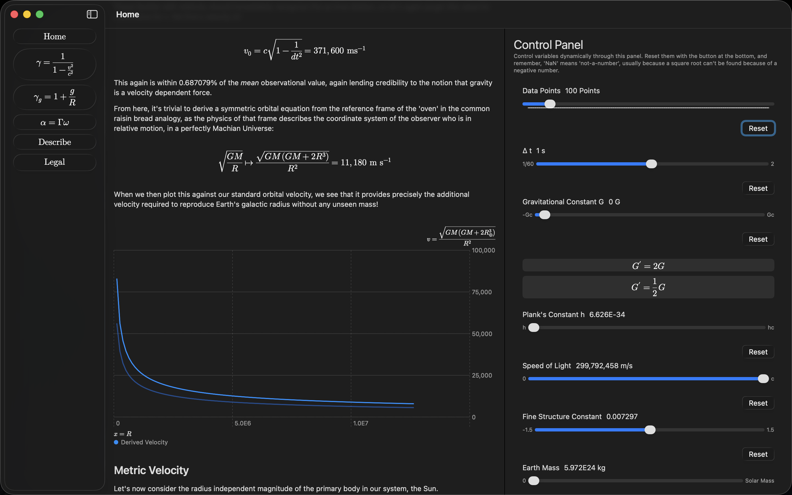

# $\alpha  \omega$ Gravity Visualizer

This app is an interactive walk through the $\alpha \omega$ gravity model, allowing the user to experiment with the value of various variables, dynamically updating the plots and content. You can think of it as a bundled, more performant jupyter notebook that's unfortuntaely mac-specific.

The app aims to demonstrate the path from the traditional interpretation of relativity to the $\alpha \omega$ gravity model in which the 'lighthouse' and the 'clock-tower' are further separated in the coordinate system of the observer that is in motion with respect to local gravitational acceleration.

You can find a more complete derivation [here](https://www.flusterapp.com/blog/by_path/on_the_gravitational_nature_of_time), and an app that was built to promote this model [here](https://apps.apple.com/us/app/fluster-academic-note-taking/id6782389505?mt=12).

